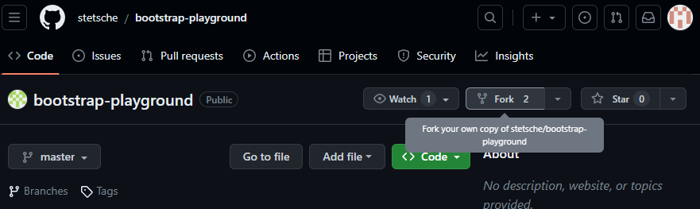
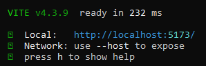

# Bootstrap Playground

## Host the Webpage locally
In order to see the webpage working and with all functionality skip the *Getting started* part and go to the [*local Hosting*](#local-hosting) part and download this [empty](https://github.com/stetsche/bootstrap-playground) or this [sample repository](https://github.com/SirSaibot/bootstrap-playground) and use it instead of forking your own repository. 

## Getting started 
### Installing prerequisites

First of you need to install some programms in case you don't already have them:
- NodeJS (https://nodejs.org/en/download)
- Github Desktop (https://desktop.github.com) or Git (https://git-scm.com/downloads)

Optional, but recommended applications:
- Visual Studio Code (https://code.visualstudio.com/download)
- a nice Browser (not Internet Explorer or Microsoft Edge)

After downloading and installing everything, you want to go to the [boostrap-playground repository](https://github.com/stetsche/bootstrap-playground) (https://github.com/stetsche/bootstrap-playground) and in the top-right click on the Fork button.

On the page that opens you can change the owner, name and description but it's recommended to leave everything as it is and press *create fork*.
After a few seconds it should be done, now you can look at your own repositories and there should be a new one named *bootstrap-playground* (if you didn't change the name).

This tutorial is for Github Desktop only. It is very much possible archive the same with Git or similar options but this guide focuses on GithubDesktop.

### Github Desktop
Once you have opened Github Desktop, there should be the option to open one of your repositories. Choose the just forked repository. After a couple of seconds everything should be ready. 

If you did not install Visual Studio Code you can skip the next step and open the files index.html and style.css manually in other programms like notepad.

### Visual Studio Code
Open Visual Studio Code and on the top left click on *Explorer*. There should be the option to open a folder. Click on that and the navigate towards the local path of the just created repository. Afterwards you should see some files and folders coming up on the left side. Open `index.html` and `style.css` by simply clicking on them. 
Now you can freely edit the html and css file towards your liking. Inorder to see your work displayed as if it was a real webpage proceed to the next step.

## local Hosting 
### Configure node.js
This guide requires you to have NodeJs already installed, if you do proceed, if no you can download it here [NodeJS](https://nodejs.org/en/download) (https://nodejs.org/en/download). Navigate towards the repository and copy its path (e.g: "C:\Users\User\Documents\GitHub\bootstrap-playground"). Open cmd by pressing Win + r, typing `cmd` and pressing enter. In the just opend window type `cd ` followed by the just copied path.
Example:

`cd C:\Users\User\Documents\GitHub\bootstrap-playground`

Press Enter and then type:

`npm install`

and press Enter. After a few minutes the installation should be complete. You can do the next step in the same window. From now on just do the next step, you don't need to do this step again.

### Start local hosting
In the cmd window with the path of your folder (where the index.html file is located), type:

`npm run dev`

and press Enter. Now there should be a URL with localhost like this:

Press on the *o* -key and a window in your default browser should open displaying your index.html page. The page automatically refreshes everytime you save some changes to any of your files.